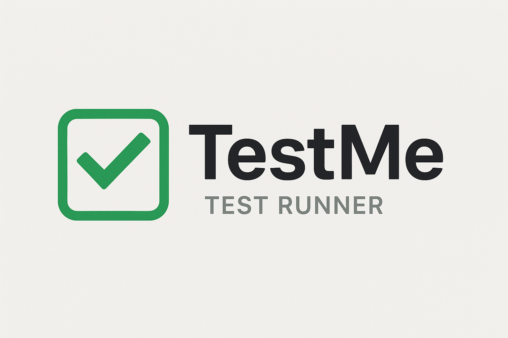

# TestMe - Multi-language Test Runner

<p align="center">
  
</p>

TestMe is a powerful, multi-language test runner built with [Bun](https://bun.sh) that can discover, compile, and execute tests across different programming languages with configurable patterns and parallel execution.

## 🚀 Features

-   **Multi-language Support**: Shell (`.tst.sh`), PowerShell (`.tst.ps1`), Batch (`.tst.bat`, `.tst.cmd`), C (`.tst.c`), JavaScript (`.tst.js`), TypeScript (`.tst.ts`), Python (`.tst.py`), Go (`.tst.go`), Ejscript (`.tst.es`)
-   **Automatic Compilation**: C programs are compiled automatically with platform-appropriate compilers (GCC/Clang/MSVC)
-   **Cross-platform**: Full support for Windows, macOS, and Linux with native test types for each platform
-   **Recursive Discovery**: Finds test files at any depth in directory trees
-   **Pattern Matching**: Filter tests using glob patterns, file names, or directory names
-   **Parallel Execution**: Run tests concurrently for better performance
-   **Artifact Management**: Organized build artifacts in `.testme` directories
-   **Hierarchical Configuration**: `testme.json5` files with tree traversal lookup
-   **Environment Variables**: Dynamic environment setup with glob expansion support
-   **Test Control**: Skip scripts, depth requirements, and enable/disable flags
-   **Multiple Output Formats**: Simple, detailed, and JSON reporting
-   **Integrated Debugging**: Multi-language debug support with platform-specific debuggers
    -   C: GDB, LLDB, Xcode, Visual Studio, VS Code
    -   JavaScript/TypeScript: Bun inspector, VS Code
    -   Python: pdb, VS Code
    -   Go: Delve, VS Code

## 📋 Table of Contents

-   [Installation](#installation)
-   [Quick Start](#quick-start)
-   [Usage](#usage)
-   [Test File Types](#test-file-types)
-   [Configuration](#configuration)
-   [Common Use Cases](#common-use-cases)
-   [Output Formats](#output-formats)
-   [Development](#development)
-   [Tips and Best Practices](#tips-and-best-practices)
-   [Publishing](#publishing)

## 🔧 Installation

### Prerequisites

TestMe requires **Bun** to be installed and operate.

**[Bun](https://bun.sh)** - Fast JavaScript runtime with built-in TypeScript support

For installation, visit [bun.sh](https://bun.sh) for installation instructions.

Ensure the Bun bin directory is in your path.

For Unix/Linux/macOS:

```sh
export "PATH=~/.bun/bin:$PATH"
```

on Windows with PowerShell:

```powershell
setx PATH "$($env:PATH);$env:USERPROFILE\.bun\bin"
```

### Quick Install

```bash
bun install -g @embedthis/testme
```

### Manual Installation from GitHub

#### Unix/Linux/macOS

1. Clone or download the tm project

2. Install dependencies:
    ```bash
    bun install
    ```
3. Build the project:

    ```bash
    bun run build
    ```

4. Install the project (on MacOS/Linux only):
    ```bash
    sudo bun run install
    ```

#### Windows

##### 1. Build and Install

```powershell
# Install dependencies
bun install

# Build
bun run build
```

## 🚀 Quick Start

### Initialize a New Project

```bash
# Create a testme.json5 configuration file
tm --init

# Create test files from templates
tm --new math.c        # Creates math.tst.c
tm --new api.js        # Creates api.tst.js
tm --new test.sh       # Creates test.tst.sh
tm --new types.ts      # Creates types.tst.ts
```

### Manual Setup

1. **Create test files** with the appropriate extensions:

    ```bash
    # C test
    echo '#include "testme.h"
    int main() { teq(2+2, 4, "math works"); return 0; }' > math.tst.c

    # JavaScript test
    echo 'console.log("✓ Test passed"); process.exit(0);' > test.tst.js
    ```

2. **Run tests**:

    ```bash
    # Run all tests
    tm

    # Run specific tests
    tm "*.tst.c"

    # Run tests in a directory
    tm integration

    # List available tests
    tm --list
    ```

3. **Clean up build artifacts**:
    ```bash
    tm --clean
    ```

## 📝 Test File Types

TestMe supports multiple test file types across platforms. All tests should exit with code 0 for success, non-zero for failure.

### Shell Tests (`.tst.sh`)

Shell script tests that are executed directly. Exit code 0 indicates success.

```bash
#!/bin/bash
# test_example.tst.sh

echo "Running shell test..."
result=$((2 + 2))
if [ $result -eq 4 ]; then
    echo "✓ Math test passed"
    exit 0
else
    echo "✗ Math test failed"
    exit 1
fi
```

### PowerShell Tests (`.tst.ps1`) - Windows

PowerShell script tests for Windows environments.

```powershell
# test_example.tst.ps1
Write-Host "Running PowerShell test..."

$result = 2 + 2
if ($result -eq 4) {
    Write-Host "✓ Math test passed"
    exit 0
} else {
    Write-Host "✗ Math test failed"
    exit 1
}
```

### Batch Tests (`.tst.bat`, `.tst.cmd`) - Windows

Windows batch script tests.

```batch
@echo off
REM test_example.tst.bat

echo Running batch test...
set /a result=2+2
if %result% == 4 (
    echo Test passed
    exit /b 0
) else (
    echo Test failed
    exit /b 1
)
```

### C Tests (`.tst.c`)

C programs that are compiled automatically before execution. Include `testme.h` for built-in testing utilities, or use standard assertions and exit codes.

```c
// test_math.tst.c
#include "testme.h"

int add(int a, int b) {
    return a + b;
}

int main() {
    tinfo("Running C math tests...\n");

    // Test basic arithmetic
    teq(add(2, 3), 5, "Addition test");
    tneq(add(2, 3), 6, "Addition inequality test");
    ttrue(add(5, 0) == 5, "Identity test");

    // Test environment variable access
    const char *binPath = tget("BIN", "/default/bin");
    ttrue(binPath != NULL, "BIN environment variable available");

    // Check if running in verbose mode
    if (thas("TESTME_VERBOSE")) {
        tinfo("Verbose mode enabled\n");
    }

    return 0;
}
```

#### C Testing Functions (testme.h)

-   `teq(a, b, msg)` - Assert two values are equal
-   `tneq(a, b, msg)` - Assert two values are not equal
-   `ttrue(expr, msg)` - Assert expression is true
-   `tfalse(expr, msg)` - Assert expression is false
-   `tmatch(str, pattern, msg)` - Assert string matches pattern
-   `tcontains(str, substr, msg)` - Assert string contains substring
-   `tfail(msg)` - Fail test with message
-   `tget(key, default)` - Get environment variable with default
-   `tgeti(key, default)` - Get environment variable as integer
-   `thas(key)` - Check if environment variable exists
-   `tdepth()` - Get current test depth
-   `tinfo(...)`, `tdebug(...)` - Print informational messages

### JavaScript Tests (`.tst.js`)

JavaScript tests executed with Bun runtime. Import `testme.js` for built-in testing utilities, or use standard assertions.

```javascript
// test_array.tst.js
import {teq, tneq, ttrue, tinfo, tget, thas} from './testme.js'

tinfo('Running JavaScript tests...')

const arr = [1, 2, 3]
const sum = arr.reduce((a, b) => a + b, 0)

// Test using testme utilities
teq(sum, 6, 'Array sum test')
tneq(sum, 0, 'Array sum is not zero')
ttrue(arr.length === 3, 'Array has correct length')

// Test environment variable access
const binPath = tget('BIN', '/default/bin')
ttrue(binPath !== null, 'BIN environment variable available')

// Check if running in verbose mode
if (thas('TESTME_VERBOSE')) {
    tinfo('Verbose mode enabled')
}
```

#### JavaScript Testing Functions (testme.js)

-   `teq(received, expected, msg)` - Assert two values are equal
-   `tneq(received, expected, msg)` - Assert two values are not equal
-   `ttrue(expr, msg)` - Assert expression is true
-   `tfalse(expr, msg)` - Assert expression is false
-   `tmatch(str, pattern, msg)` - Assert string matches regex pattern
-   `tcontains(str, substr, msg)` - Assert string contains substring
-   `tfail(msg)` - Fail test with message
-   `tget(key, default)` - Get environment variable with default
-   `thas(key)` - Check if environment variable exists (as number)
-   `tdepth()` - Get current test depth
-   `tverbose()` - Check if verbose mode is enabled
-   `tinfo(...)`, `tdebug(...)` - Print informational messages
-   `tassert(expr, msg)` - Alias for `ttrue`

### TypeScript Tests (`.tst.ts`)

TypeScript tests executed with Bun runtime (includes automatic transpilation). Import `testme.js` for built-in testing utilities.

```typescript
// test_types.tst.ts
import {teq, ttrue, tinfo, tget} from './testme.js'

tinfo('Running TypeScript tests...')

interface User {
    name: string
    age: number
}

const user: User = {name: 'John', age: 30}

// Test using testme utilities with TypeScript types
teq(user.name, 'John', 'User name test')
teq(user.age, 30, 'User age test')
ttrue(typeof user.name === 'string', 'Name is string type')
ttrue(typeof user.age === 'number', 'Age is number type')

// Test environment variable access with types
const binPath: string | null = tget('BIN', '/default/bin')
ttrue(binPath !== null, 'BIN environment variable available')
```

**Note**: TypeScript tests use the same testing functions as JavaScript tests since both run on the Bun runtime with full TypeScript support.

### Python Tests (`.tst.py`)

Python tests executed with the Python runtime. Exit code 0 indicates success.

```python
#!/usr/bin/env python3
# test_example.tst.py

import sys

def test_math():
    result = 2 + 2
    assert result == 4, "Math test failed"
    print("✓ Math test passed")

if __name__ == "__main__":
    try:
        test_math()
        sys.exit(0)  # Success
    except AssertionError as e:
        print(f"✗ {e}")
        sys.exit(1)  # Failure
```

### Go Tests (`.tst.go`)

Go programs that are compiled and executed automatically. Exit code 0 indicates success.

```go
// test_math.tst.go
package main

import (
    "fmt"
    "os"
)

func add(a, b int) int {
    return a + b
}

func main() {
    // Test basic arithmetic
    if add(2, 3) != 5 {
        fmt.Println("✗ Addition test failed")
        os.Exit(1)
    }
    fmt.Println("✓ Addition test passed")

    // Test identity
    if add(5, 0) != 5 {
        fmt.Println("✗ Identity test failed")
        os.Exit(1)
    }
    fmt.Println("✓ Identity test passed")

    os.Exit(0)
}
```

## 🎯 Usage

### Command Syntax

```bash
tm [OPTIONS] [PATTERNS...]
```

### Pattern Matching

Filter tests using various pattern types:

-   **File patterns**: `"*.tst.c"`, `"math.tst.js"`
-   **Base names**: `"math"` (matches math.tst.c, math.tst.js, etc.)
-   **Directory names**: `"integration"`, `"unit/api"` (runs all tests in directory)
-   **Path patterns**: `"**/math*"`, `"test/unit/*.tst.c"`

### Common Options

| Option                | Description                           |
| --------------------- | ------------------------------------- |
| `-l, --list`          | List discovered tests without running |
| `-v, --verbose`       | Show detailed output                  |
| `-q, --quiet`         | Silent mode (exit codes only)         |
| `-c, --config <FILE>` | Use specific config file              |
| `--clean`             | Remove all `.testme` artifacts        |
| `-d, --debug`         | Launch debugger (GDB/Xcode)           |
| `-k, --keep`          | Keep artifacts after tests            |
| `--depth <N>`         | Run tests requiring depth ≤ N         |
| `-w, --workers <N>`   | Set parallel workers                  |
| `-s, --show`          | Display C compile commands            |
| `--step`              | Run tests one at a time with prompts  |

### Usage Examples

```bash
# Basic usage
tm                              # Run all tests
tm --list                       # List tests without running
tm "*.tst.c"                    # Run only C tests

# Pattern filtering
tm integration                  # Run all tests in integration/ directory
tm test/unit                    # Run tests in test/unit/ directory
tm "math*"                      # Run tests starting with 'math'
tm "**/api*"                    # Run tests with 'api' in path

# Advanced options
tm -v integration               # Verbose output for integration tests
tm --depth 2                    # Run tests requiring depth ≤ 2
tm --debug math.tst.c           # Debug specific C test
tm -s "*.tst.c"                 # Show compilation commands
tm --keep "*.tst.c"             # Keep build artifacts

# Configuration
tm -c custom.json5              # Use custom config
tm --chdir /path/to/tests       # Change directory first
```

### Working Directory Behavior

All tests execute with their working directory set to the directory containing the test file, allowing reliable access to relative files and resources.

## ⚙️ Configuration

### Configuration File (`testme.json5`)

TestMe supports hierarchical configuration using nested `testme.json5` files throughout your project structure. Each test file gets its own configuration by walking up from the test file's directory to find the nearest configuration file.

#### Configuration Discovery Priority (highest to lowest):

1. CLI arguments
2. Test-specific `testme.json5` (nearest to test file)
3. Project `testme.json5` (walking up directory tree)
4. Built-in defaults

This enables:

-   Project-wide defaults at the repository root
-   Module-specific overrides in subdirectories
-   Test-specific configuration closest to individual tests
-   Automatic merging with CLI arguments preserved

```json
{
    "enable": true,
    "depth": 0,
    "compiler": {
        "c": {
            "compiler": "gcc",
            "flags": ["-std=c99", "-Wall", "-Wextra", "-O2"]
        },
        "es": {
            "require": "testme"
        }
    },
    "execution": {
        "timeout": 30000,
        "parallel": true,
        "workers": 4
    },
    "output": {
        "verbose": false,
        "format": "simple",
        "colors": true
    },
    "patterns": {
        "include": [
            "**/*.tst.sh",
            "**/*.tst.c",
            "**/*.tst.js",
            "**/*.tst.ts",
            "**/*.tst.es",
            "**/*.tst.ps1",
            "**/*.tst.bat",
            "**/*.tst.cmd"
        ],
        "exclude": ["**/node_modules/**", "**/.testme/**", "**/.*/**"]
    },
    "services": {
        "skip": "./check-requirements.sh",
        "prep": "make build",
        "setup": "docker-compose up -d",
        "cleanup": "docker-compose down",
        "skipTimeout": 30000,
        "prepTimeout": 30000,
        "setupTimeout": 30000,
        "cleanupTimeout": 10000,
        "delay": 3000
    },
    "env": {
        "BIN": "${../build/*/bin}",
        "LIB_PATH": "${../lib}",
        "TEST_DATA": "${./test-data/*.json}"
    }
}
```

### Configuration Options

#### Test Control Settings

-   `enable` - Enable or disable tests in this directory (default: true)
-   `depth` - Minimum depth required to run tests (default: 0, requires `--depth N` to run)

#### Compiler Settings

##### C Compiler Configuration

TestMe automatically detects and configures the appropriate C compiler for your platform:

-   **Windows**: MSVC (Visual Studio), MinGW, or Clang
-   **macOS**: Clang or GCC
-   **Linux**: GCC or Clang

**Default Flags (automatically applied):**

-   **GCC/Clang**: `-std=c99 -Wall -Wextra -Wno-unused-parameter -Wno-strict-prototypes -O0 -g -I. -I/usr/local/include -L/usr/local/lib -I/opt/homebrew/include -L/opt/homebrew/lib`
-   **MSVC**: `/std:c11 /W4 /Od /Zi /nologo`

**Configuration Options:**

-   `compiler.c.compiler` - C compiler path (optional, use 'default' to auto-detect, or specify 'gcc', 'clang', or full path)
-   `compiler.c.gcc.flags` - GCC-specific flags (merged with GCC defaults)
-   `compiler.c.gcc.libraries` - GCC-specific libraries (e.g., `['m', 'pthread']`)
-   `compiler.c.clang.flags` - Clang-specific flags (merged with Clang defaults)
-   `compiler.c.clang.libraries` - Clang-specific libraries
-   `compiler.c.msvc.flags` - MSVC-specific flags (merged with MSVC defaults)
-   `compiler.c.msvc.libraries` - MSVC-specific libraries

**Variable Expansion:**

Environment variables in compiler flags and paths support `${...}` expansion:

-   `${PLATFORM}` - Current platform (e.g., macosx-arm64, linux-x64, win-x64)
-   `${OS}` - Operating system (macosx, linux, windows)
-   `${ARCH}` - CPU architecture (arm64, x64, x86)
-   `${PROFILE}` - Build profile (debug, release, dev, prod, etc.)
-   `${CC}` - Compiler name (gcc, clang, msvc)
-   `${CONFIGDIR}` - Directory containing the testme.json5 file
-   `${TESTDIR}` - Relative path from executable to test file directory
-   `${pattern}` - Glob patterns (e.g., `${../build/*/bin}` expands to matching paths)

**Example:**

```json5
{
    compiler: {
        c: {
            compiler: 'default', // Auto-detect best compiler

            gcc: {
                flags: [
                    '-I${../build/${PLATFORM}-${PROFILE}/inc}',
                    '-L${../build/${PLATFORM}-${PROFILE}/bin}',
                    '-Wl,-rpath,@executable_path/${CONFIGDIR}/../build/${PLATFORM}-${PROFILE}/bin',
                ],
                libraries: ['m', 'pthread'],
            },
            clang: {
                flags: [
                    '-I${../build/${PLATFORM}-${PROFILE}/inc}',
                    '-L${../build/${PLATFORM}-${PROFILE}/bin}',
                    '-Wl,-rpath,@executable_path/${CONFIGDIR}/../build/${PLATFORM}-${PROFILE}/bin',
                ],
                libraries: ['m', 'pthread'],
            },
            msvc: {
                flags: ['/I${../build/${PLATFORM}-${PROFILE}/inc}'],
                libraries: [],
            },
        },
    },
}
```

##### Ejscript Compiler Configuration

-   `compiler.es.require` - Ejscript modules to preload with `--require` (string or array)

#### Execution Settings

-   `execution.timeout` - Test timeout in milliseconds (default: 30000)
-   `execution.parallel` - Enable parallel execution (default: true)
-   `execution.workers` - Number of parallel workers (default: 4)

#### Output Settings

-   `output.verbose` - Enable verbose output (default: false)
-   `output.format` - Output format: "simple", "detailed", "json" (default: "simple")
-   `output.colors` - Enable colored output (default: true)

#### Pattern Settings

Pattern configuration supports platform-specific patterns that are deep blended with base patterns:

-   `patterns.include` - Array of include patterns applied to all platforms
-   `patterns.exclude` - Array of exclude patterns applied to all platforms
-   `patterns.windows.include` - Additional patterns for Windows (merged with base)
-   `patterns.windows.exclude` - Additional exclude patterns for Windows
-   `patterns.macosx.include` - Additional patterns for macOS (merged with base)
-   `patterns.macosx.exclude` - Additional exclude patterns for macOS
-   `patterns.linux.include` - Additional patterns for Linux (merged with base)
-   `patterns.linux.exclude` - Additional exclude patterns for Linux

**Pattern Merging Behavior:**

Platform-specific patterns are added to base patterns, not replaced:

1. Start with base `include` and `exclude` patterns
2. On the current platform, add platform-specific patterns to the base
3. Result is the union of base patterns and platform-specific patterns

**Example:**

```json5
{
    patterns: {
        // Base patterns for all platforms
        include: ['**/*.tst.c', '**/*.tst.js', '**/*.tst.ts'],
        exclude: ['**/node_modules/**'],

        // Windows-specific additions
        windows: {
            include: ['**/*.tst.ps1', '**/*.tst.bat'], // Added on Windows only
            exclude: ['**/wsl/**'], // Excluded on Windows only
        },

        // macOS-specific additions
        macosx: {
            include: ['**/*.tst.sh'], // Shell tests on macOS
        },

        // Linux-specific additions
        linux: {
            include: ['**/*.tst.sh'], // Shell tests on Linux
        },
    },
}
```

On Windows, the effective patterns would be:

-   Include: `**/*.tst.c`, `**/*.tst.js`, `**/*.tst.ts`, `**/*.tst.ps1`, `**/*.tst.bat`
-   Exclude: `**/node_modules/**`, `**/wsl/**`

On macOS/Linux, the effective patterns would be:

-   Include: `**/*.tst.c`, `**/*.tst.js`, `**/*.tst.ts`, `**/*.tst.sh`
-   Exclude: `**/node_modules/**`

#### Service Settings

-   `services.skip` - Script to check if tests should run (exit 0=run, non-zero=skip)
-   `services.prep` - Command to run once before all tests begin (waits for completion)
-   `services.setup` - Command to start background service during test execution
-   `services.cleanup` - Command to run after all tests complete for cleanup
-   `services.skipTimeout` - Skip script timeout in milliseconds (default: 30000)
-   `services.prepTimeout` - Prep command timeout in milliseconds (default: 30000)
-   `services.setupTimeout` - Setup command timeout in milliseconds (default: 30000)
-   `services.cleanupTimeout` - Cleanup command timeout in milliseconds (default: 10000)
-   `services.delay` - Delay after setup before running tests in milliseconds (default: 0)

#### Environment Variables

-   `env` - Object defining environment variables to set during test execution
-   Environment variable values support `${...}` expansion using glob patterns
-   Paths are resolved relative to the configuration file's directory
-   Useful for providing dynamic paths to build artifacts, libraries, and test data

**Examples:**

```json
{
    "env": {
        "BIN": "${../build/*/bin}", // Expands to build directory path
        "LIB_PATH": "${../lib}", // Points to library directory
        "TEST_DATA": "${./test-data/*.json}", // Expands to test data files
        "API_URL": "http://localhost:8080" // Static values work too
    }
}
```

**Accessing Environment Variables:**

-   C tests: `getenv("BIN")` or use `tget("BIN", default)` from testme.h
-   Shell tests: `$BIN` or `${BIN}`
-   JavaScript/TypeScript: `process.env.BIN` or use `tget("BIN", default)` from testme.js

## 📚 Common Use Cases

### Testing a Multi-Platform C Project

```json5
{
    compiler: {
        c: {
            gcc: {
                flags: [
                    '-I${../include}',
                    '-L${../build/${PLATFORM}-${PROFILE}/lib}',
                    '-Wl,-rpath,@executable_path/${CONFIGDIR}/../build/${PLATFORM}-${PROFILE}/lib',
                ],
                libraries: ['mylib', 'm', 'pthread'],
            },
            msvc: {
                flags: ['/I${../include}', '/LIBPATH:${../build/${PLATFORM}-${PROFILE}/lib}'],
                libraries: ['mylib'],
            },
        },
    },
    env: {
        MY_LIB_PATH: '${../build/${PLATFORM}-${PROFILE}/lib}',
    },
}
```

### Running Tests with Docker Services

```json5
{
    services: {
        prep: 'docker-compose build',
        setup: 'docker-compose up -d',
        cleanup: 'docker-compose down',
        delay: 5000, // Wait 5 seconds for services to start
    },
    env: {
        DATABASE_URL: 'postgresql://localhost:5432/testdb',
        REDIS_URL: 'redis://localhost:6379',
    },
}
```

### Conditional Test Execution

```json5
{
    services: {
        skip: './check-requirements.sh', // Exit 0 to run, non-zero to skip
    },
}
```

check-requirements.sh:

```bash
#!/bin/bash
# Skip tests if required tools are missing
if ! command -v docker &> /dev/null; then
    echo "Docker not found - skipping integration tests"
    exit 1
fi
exit 0
```

### Organizing Tests by Depth

Root testme.json5 (quick unit tests):

```json5
{
    depth: 0,
    execution: {timeout: 5000},
}
```

integration/testme.json5 (slow integration tests):

```json5
{
    depth: 1,
    execution: {timeout: 60000},
    services: {
        setup: './start-services.sh',
        cleanup: './stop-services.sh',
    },
}
```

Run with: `tm --depth 1` to include integration tests, or just `tm` for unit tests only.

## 📁 Artifact Management

TestMe automatically creates `.testme` directories alongside test files for C compilation artifacts:

```
project/tests/
├── math.tst.c
└── .testme/
    ├── math              # Compiled binary
    └── compile.log       # Compilation output
```

Use `tm --clean` to remove all artifact directories, or `tm --keep` to preserve them after tests run.

## 🐛 Debugging Tests

TestMe includes integrated debugging support for all test languages. Use the `--debug` flag to launch tests in debug mode.

### C Test Debugging

```bash
# Debug a specific C test
tm --debug math.tst.c

# Configured debuggers (auto-selected by platform):
# - macOS: xcode (default), lldb, gdb, vscode
# - Linux: gdb (default), lldb, vscode
# - Windows: vs (default), vscode
```

**Configuration:**
```json5
{
    debug: {
        c: 'xcode',  // Use specific debugger
        // Or use platform map:
        c: {
            macosx: 'xcode',
            linux: 'gdb',
            windows: 'vs'
        }
    }
}
```

### JavaScript/TypeScript Debugging

```bash
# Debug JavaScript test
tm --debug api.tst.js

# Debug TypeScript test
tm --debug types.tst.ts
```

**VSCode Workflow (default):**

Prerequisites:
- Install the [Bun VSCode extension](https://marketplace.visualstudio.com/items?itemName=oven.bun-vscode)

Steps:
1. Run `tm --debug test.tst.js` (or `.tst.ts`)
2. TestMe automatically creates `.vscode/launch.json` in test directory
3. VSCode opens with the workspace
4. Open your test file and set breakpoints
5. Press F5 or Run > Start Debugging
6. Select "Debug Bun Test" configuration

**Configuration:**
```json5
{
    debug: {
        js: 'vscode',  // JavaScript debugger (default)
        // js: 'cursor', // Or use Cursor editor
        ts: 'vscode',  // TypeScript debugger (default)
        // ts: 'cursor', // Or use Cursor editor
    }
}
```

**Supported Debuggers:**
- `vscode` - Visual Studio Code (default)
- `cursor` - Cursor editor (VSCode fork)
- Custom path to debugger executable

### Python Test Debugging

```bash
# Debug with pdb (default)
tm --debug test.tst.py

# Configure to use VSCode
# Edit testme.json5: debug: { py: 'vscode' }
```

**pdb commands:**
- `h` - help
- `b <line>` - set breakpoint
- `c` - continue
- `n` - next line
- `s` - step into
- `p <var>` - print variable
- `q` - quit

**Configuration:**
```json5
{
    debug: {
        py: 'pdb',      // Use Python debugger (default)
        // py: 'vscode', // Or use VSCode
    }
}
```

### Go Test Debugging

```bash
# Debug with delve (default)
tm --debug calc.tst.go

# Configure to use VSCode
# Edit testme.json5: debug: { go: 'vscode' }
```

**delve commands:**
- `help` - show help
- `break <line>` - set breakpoint
- `continue` - continue execution
- `next` - step over
- `step` - step into
- `print <var>` - print variable
- `exit` - exit debugger

**Configuration:**
```json5
{
    debug: {
        go: 'delve',    // Use Delve debugger (default)
        // go: 'vscode', // Or use VSCode
    }
}
```

### Custom Debugger

You can specify a custom debugger executable path:

```json5
{
    debug: {
        c: '/usr/local/bin/my-gdb',
        py: '/opt/debugger/pdb-enhanced',
    }
}
```

## 🔍 Output Formats

### Simple Format (Default)

```
🧪 Test runner starting in: /path/to/project

Running tests...

✓ PASS string.tst.ts (11ms)
✓ PASS array.tst.js (10ms)
✓ PASS hello.tst.sh (4ms)
✓ PASS math.tst.c (204ms)

============================================================
TEST SUMMARY
============================================================
✓ Passed: 4
✗ Failed: 0
! Errors: 0
- Skipped: 0
Total: 4
Duration: 229ms

Result: PASSED
```

### Detailed Format

Shows full output from each test including compilation details for C tests.

### JSON Format

Machine-readable output for integration with other tools:

```json
{
    "summary": {
        "total": 4,
        "passed": 4,
        "failed": 0,
        "errors": 0,
        "skipped": 0,
        "totalDuration": 229
    },
    "tests": [
        {
            "file": "/path/to/test.tst.js",
            "type": "javascript",
            "status": "passed",
            "duration": 10,
            "exitCode": 0
        }
    ]
}
```

## 🧪 Development

### Building

```bash
bun run build
```

### Running Tests

```bash
bun test
```

### Development Mode

```bash
bun --hot src/index.ts
```

### Code Style

-   4-space indentation
-   TypeScript with strict mode
-   ESLint and Prettier configured
-   Comprehensive JSDoc comments

## 💡 Tips and Best Practices

### Writing Effective Tests

1. **Use descriptive names**: `user_authentication.tst.ts` not `test1.tst.ts`
2. **Keep tests focused**: One concept per test file
3. **Exit with proper codes**: 0 for success, non-zero for failure
4. **Document test purpose**: Add comments explaining what's being validated

### Performance Optimization

-   Use parallel execution for independent tests (default behavior)
-   Adjust worker count based on system resources: `tm -w 8`
-   Clean artifacts regularly: `tm --clean`

### Troubleshooting

| Problem                   | Solution                                                                                                                                                                         |
| ------------------------- | -------------------------------------------------------------------------------------------------------------------------------------------------------------------------------- |
| **Tests not discovered**  | Check file extensions (`.tst.sh`, `.tst.c`, `.tst.js`, `.tst.ts`, `.tst.es`)<br>Use `--list` to see what's found<br>Check `enable: false` in config<br>Verify depth requirements |
| **C compilation failing** | Check GCC/Clang is in PATH<br>Review `.testme/compile.log`<br>Use `-s` to see compile commands                                                                                   |
| **Permission errors**     | Make shell scripts executable: `chmod +x *.tst.sh`<br>Check directory permissions                                                                                                |
| **Tests skipped**         | Check skip script exit code<br>Verify `--depth` is sufficient<br>Run with `-v` for details                                                                                       |

### Windows-Specific Issues

| Problem                         | Solution                                                                                                             |
| ------------------------------- | -------------------------------------------------------------------------------------------------------------------- |
| **`tm` not recognized**         | Add `%USERPROFILE%\.local\bin` to PATH<br>Or run from installation directory                                         |
| **PowerShell execution policy** | TestMe uses `-ExecutionPolicy Bypass` automatically<br>Or set: `Set-ExecutionPolicy RemoteSigned -Scope CurrentUser` |
| **Compiler not found**          | Run from "Developer Command Prompt for VS 2022"<br>Or add compiler to PATH manually                                  |
| **MSVC vs GCC flags**           | Check `testme.json5` compiler config<br>MSVC: `/W4 /std:c11`<br>GCC/MinGW: `-std=c99 -Wall -Wextra`                  |
| **Shell tests fail on Windows** | Install Git for Windows (includes bash)<br>Or convert to `.tst.ps1` or `.tst.bat`                                    |

---

## 📦 Publishing

If you're a package maintainer or want to contribute TestMe to additional repositories:

-   **[Publishing Guide](doc/PUBLISHING.md)** - Complete step-by-step instructions for publishing to all package repositories
-   **[Quick Reference](doc/PUBLISHING-QUICKREF.md)** - One-page reference for package publishing
-   **[Installation Packages](installs/README.md)** - Package configurations and build instructions

---

For detailed documentation, see `man tm` or the [Design Documentation](doc/DESIGN.md).
